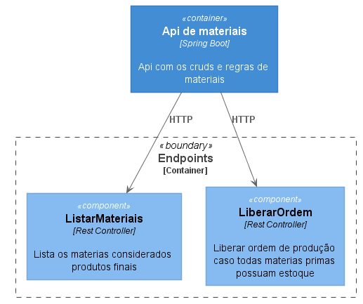
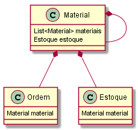

# Desafio Guararapes QA

Bem vindos ao desafio de QA guararapes, nessa fase precisamos validar seus conhecimentos em nossa Stack, leia toda a documentação abaixo para realizar.

## Esqueletos

O candidato precisa criar os testes utilizando o esqueleto fornecido (encontra-se na pasta testing), porém esteja a vontade para inovar e pensar fora da caixa, todas as ferramentas citadas abaixo estão inclusas no esqueleto. Não é preciso fazer um fork desse projeto, porém favor entregar um projeto fechado na [gitlab](http://gitlab.com) (para que outros candidatos não vizualizem a sua solução).

## Linguagens

* Javascript / [NodeJS](https://nodejs.org/en/) ECMA 6+

## Libs

* [Jest](https://jestjs.io/docs/en/getting-started.html)  - Biblioteca de testes para Javascript
* [Puppeteer](https://github.com/puppeteer/puppeteer) - Versão Headless do chrome que pode ser usado para webcrawling e também para testes de frontend em um ambiente não gráfico
* [Jest-Puppeteer](https://jestjs.io/docs/en/puppeteer) - Junção do Jester com o puppeteer para criar uma suite de testes funcionais em javascript utilizando o pode do jester e puppeteer
* [Axios](https://github.com/axios/axios) - Cliente HTTP para a linguagem Javascript / NodeJS

## Tools

* [Npm](https://www.npmjs.com/) - Package manager do nodejs
* [Nginx](https://www.nginx.com/) - Servidor web e load balancer open source
* [Java 11](https://www.oracle.com/java/technologies/javase-jdk11-downloads.html) - Linguagem de programação multiplataforma de alto desempenho

## Passo 1

Analise abaixo uma tarefa que foi passada ao desenvolvedor:

### Tarefa passada ao desenvolvedor

* Crie uma api restful que contenha um crud de materiais, cada material pode se relacionar com outros materiais, formando uma arvore, porém é importante de observar que os materiais da raiz (aqueles que não tem pais) são considerados produtos finais (camisas, calças, vestidos, etc) e os materiais "filhos" são sempre materias primas (tecido, linha, tinta, etc)
* Crie tambem um crud de criação de ordems de produção, que podem ser criadas a partir de um produto final caso todas as suas matérias primas possuam estoque
* Crie um frontend em SPA para listar os materiais considerados produtos finais (camisas, calças, vestidos, etc), nessa listagem deve haver um botão de liberar ordem de produção, porém esse botão só deve funcionar no caso em que o produto possua todas as suas matérias primas em estoque.

### Contexto da tarefa

### Componentes da tarefa

### Domínio da tarefa (base de dados)

### Critérios de aceite da tarefa solicitada ao desenvolvedor

* Pode ser usado H2, Sqlite ou postgres
* Documente suas API's (pode ser OpenApi + Swagger)

## Passo 2

Após ser desenvolvido, o que foi entregue pelo desenvolvedor está contido nas pasta backend (api em java com spring), trata de um jar que precisa ser executado com java 11, e na pasta frontend uma página criada com angular, porém o conteúdo da pasta trata-se da aplicação já compilada e pronta para rodar, para tanto já foi inclusa na pasta uma versão do nginx já configurado para rodar a página (os arquivos da página encontram-se na pasta html), você precisa inicialemente rodar esses 2 projetos seguindo os seguintes passos caso esteja no windows:

* Instale o java sdk 11 em sua máquina
* Instale o nodejs e npm em sua máquina (a distro de nodejs windows já vem com npm)
* Rode os sistemas rodando os bats fornecidos (run_backend.bat e run_front.bat)
* Algum aviso de segurança do windows pode ocorrer, pois estará rodando o nginx (um arquivo .exe) desconhecido para o windows, pode ignorar o aviso tranquilamente.
* Se estiver no linux, aconselho a instalar o nginx da forma recomendada de sua distro e jogar os arquivos do front na pasta html da nova instalação.

## Passo 3

Criar testes automatizados tanto da api quanto do front seguindo a mesma estrutura e exemplos criados na pasta testing. A estrutura básica contem um projeto que já está configurado com jest, axios, puppeteer e contem 2 exemplos, um de como testar o backend e o outro de como testar o frontend. Siga os seguintes passos:

* Entre na pasta testing
* Rode o comando npm install
* Comece a criar os seus testes nos arquivos api.test.js e front.test.js (pode inovar na estrutura de pasta e arquivos a vontade)

## Passo 4

Além de criar os testes automatizados, realizar os testes manuais baseando-se no enunciado pedido ao desenvolvedor e partir disso crie um report (em markdown mesmo, pode ser inclusive aqui no readme de sua solução) criticando se de fato a demanda foi atendida pela solução entregue
